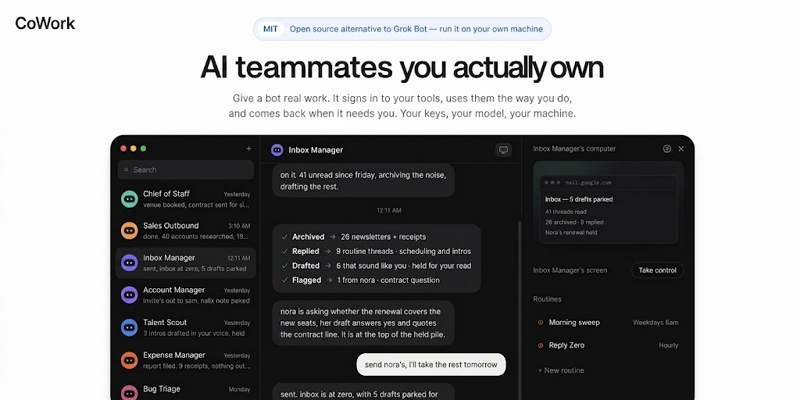

# CoWork



Open-source AI coworker platform, developed by [Suryanshu Nabheet](https://github.com/Suryanshu-Nabheet).

Web, desktop, and mobile. Bring your own AI and sandbox. Released under the [MIT License](./LICENSE).

Each bot has one thread, one computer, persistent memory, scheduled routines, and history. A bot can also spawn more bots — each a regular peer with its own thread and computer — or run short-lived subagents inside the current turn. This repository is the complete core product — it runs without any external control plane.

## Architecture & Tech Stack

- **Frontend**: React 19, Vite, Tailwind CSS, Lucide icons
- **Desktop**: Electron with macOS/Windows/Linux window management and native execution bridges
- **Mobile**: React Native & Expo (iOS and Android)
- **API & Worker**: Hono, oRPC, Better Auth, Graphile Worker
- **Database & Storage**: PostgreSQL 16, Prisma ORM, Local filesystem stores
- **AI Agent Runtime**: Pi runtime with full streaming, tools, subagents, and memory
- **Sandboxes**: Docker supervisor (isolated desktop containers with Chromium, Fluxbox & noVNC) and E2B cloud sandboxes
- **Integrations**: Composio ecosystem toolkits, Webhook push, and custom connectors

## Requirements

- **Node.js**: 22+
- **pnpm**: 9+
- **Docker Desktop**: PostgreSQL 16 plus graphical bot computer containers

## Getting Started Locally

1. **Clone and setup configuration**:

   ```bash
   git clone https://github.com/Suryanshu-Nabheet/cowork.git
   cd cowork
   cp .env.example .env
   ```

2. **Configure environment variables in `.env`**:
   - Set `BETTER_AUTH_SECRET` and `ENCRYPTION_KEY` to long random strings before any network exposure.
   - Set your preferred model key in `OPENROUTER_API_KEY` (or configure via the web UI during onboarding).
   - Optional: configure `COMPOSIO_API_KEY` for ecosystem app integrations.

3. **Install dependencies and start development environment**:

   ```bash
   # Start local PostgreSQL database
   docker compose -f infra/compose/docker-compose.yml up postgres -d

   # Install monorepo dependencies
   pnpm install

   # Generate Prisma client and run migrations
   pnpm db:generate
   pnpm db:migrate

   # Build local computer sandbox image
   pnpm sandbox:build

   # Launch all services (API :3100, Worker, Supervisor :7091, Web :5173)
   pnpm dev
   ```

4. **Access the application**:
   Open [http://127.0.0.1:5173](http://127.0.0.1:5173) in your browser. Register your account, connect a model provider, create a bot, and begin delegating tasks.

5. **Verify system health**:

   ```bash
   curl -s http://127.0.0.1:3100/health
   ```

### Computer Providers & Isolation

| `SANDBOX_PROVIDER` | Execution Target | Use Case | Isolation Level |
| --- | --- | --- | --- |
| `docker` (default) | Per-bot Docker container | Local development & trusted self-hosting | High isolation with dedicated Linux desktop, browser, and persistent `/home/cowork`. |
| `e2b` | Remote cloud sandbox | Multi-user / public deployments | Secure remote isolation with no host Docker access required. |
| `desktop` | Directly on host system | Trusted local single-user workflow | Runs directly as local user. |
| `fake` | In-process emulator | CI / Automated testing | Deterministic test environment without live containers. |

## Running the Desktop Application

With the backend running (`pnpm dev`):

```bash
pnpm --filter @cowork/desktop dev
```

To create distribution packages for macOS, Windows, or Linux:

```bash
pnpm --filter @cowork/desktop pack
```

## Running the Mobile Application

Start the Expo development server:

```bash
pnpm --filter @cowork/mobile dev
```

## Verification & Quality Bar

```bash
# Fast in-memory unit and contract tests
pnpm verify:fast

# Full integration suite with Testcontainers, API, and Playwright
pnpm verify

# Optional live provider canary checks
pnpm verify:providers
```

## Repository Structure

```
apps/
  api/          # Hono backend API and oRPC routers
  worker/       # Graphile Worker background task processor
  web/          # React 19 + Vite web client
  desktop/      # Electron desktop application
  mobile/       # React Native / Expo iOS & Android apps
  www/          # Astro static documentation and marketing site
packages/
  core/         # Core domain types, utils, and secrets guard
  contracts/    # oRPC protocol contracts and schemas
  db/           # Prisma client, migrations, and event streaming
  auth/         # Better Auth configuration and organization logic
  memory/       # Markdown-backed hierarchical memory engine
  ui-web/       # Shared UI components and styling tokens
  adapter-kit/  # Interfaces for sandboxes, runtimes, and notifications
  adapters/     # Implementations for Docker, E2B, Pi, Composio, Expo
  testkit/      # Integration test harness and test containers
infra/
  compose/      # Docker Compose recipes and configurations
  sandboxes/    # Container Dockerfile, supervisor, and desktop scripts
```

## Self-Hosting & Deployment

Refer to [`docs/self-host.md`](./docs/self-host.md) for production deployment instructions, Docker Compose setups, and backup/restore procedures.

## License

This project is licensed under the [MIT License](./LICENSE) &copy; 2026 Suryanshu Nabheet.
